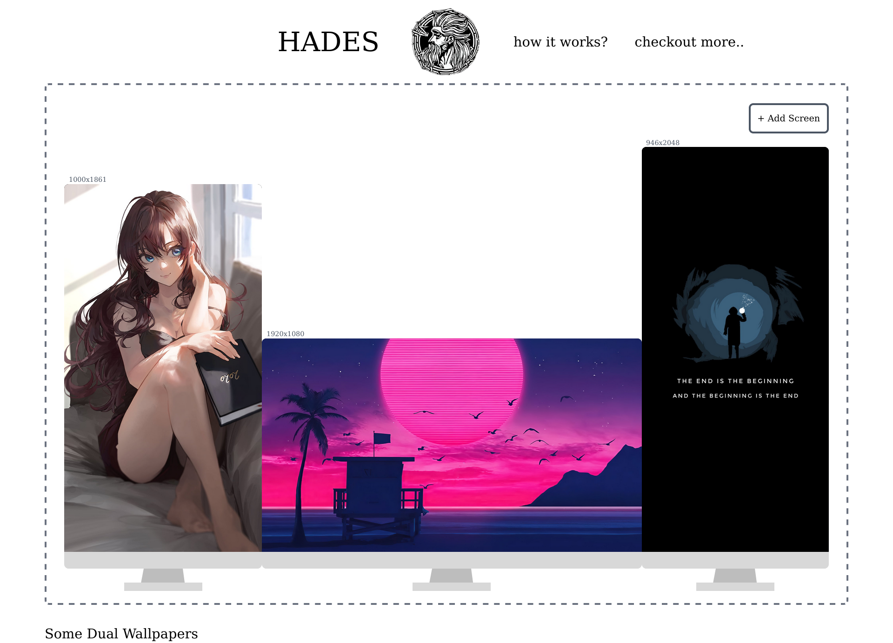
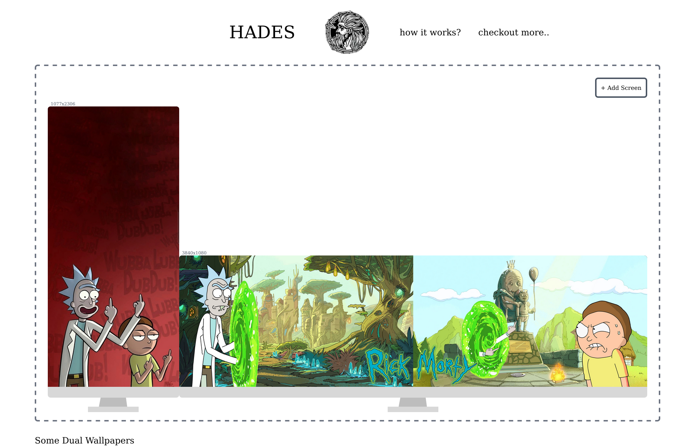

# Hades - Dual Monitor Wallpaper Generator

Stage - Early stage of development and figuring out...

## Checout out Live - [Hades](https:hades-dual-wallpaper-generator.netlify.app)

Preview - 

The Dual Monitor Wallpaper Generator is a powerful tool that allows users to effortlessly create stunning wallpapers for dual monitors or multiple screens. With this tool, users can add their desired images, preview them online, and generate the final wallpaper file.

## Features

- Upload and manage multiple images for your dual monitor or multi-screen wallpaper.
- Arrange and position images to achieve the desired composition.
- Real-time preview to visualize how the wallpaper will look on your dual monitor setup or multiple screens.
- Customize wallpaper settings such as image alignment, scaling, and background color.
- Download the generated wallpaper file in a format compatible with your operating system.
